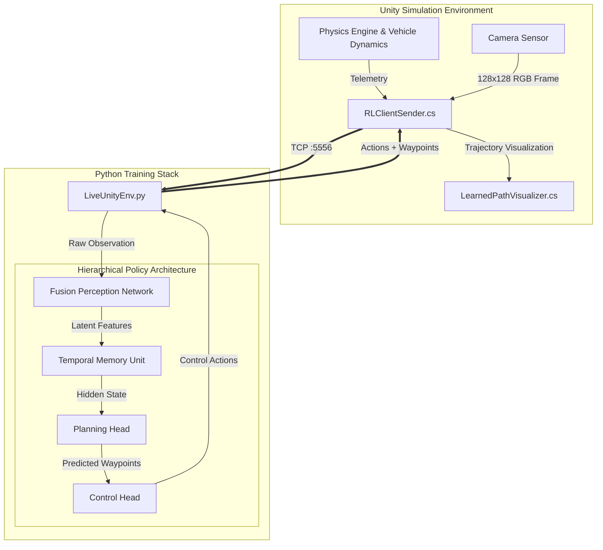
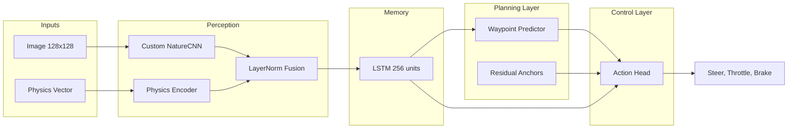

# Hierarchical Sim-to-Real Autonomous Driving Framework

This repository contains a research-grade Reinforcement Learning framework designed for end-to-end autonomous driving. The project implements a **Hierarchical Recurrent Proximal Policy Optimization (H-PPO)** agent that decouples the driving task into three distinct stages: **Perception**, **Trajectory Planning**, and **Control**.

By explicitly predicting future waypoints before generating control signals, this architecture bridges the gap between high-level path planning and low-level actuation, providing greater interpretability and stability compared to standard "black-box" Convolutional Neural Networks.

---

## System Architecture

The system operates as a closed-loop feedback control system split between a high-fidelity physics simulator (Unity) and a deep learning training environment (Python). A custom TCP bridge facilitates synchronous communication between these two components.

### Data Flow Pipeline

1. **Sensing (Unity)**: The vehicle captures a 128×128 RGB image and internal physics telemetry (speed, yaw rate, actuator states).
2. **Transmission**: The `RLClientSender` serializes this state vector and image into a binary packet and transmits it over TCP port 5556.
3. **Perception (Python)**: The `FusionFeaturesExtractor` processes the visual and physical data into a unified latent representation.
4. **Planning (Python)**: The policy's planning head predicts a sequence of spatial waypoints representing the intended trajectory over a 2.5-second horizon.
5. **Control (Python)**: The control head consumes both the temporal memory (LSTM) and the planned waypoints to output Steer, Throttle, and Brake commands.
6. **Actuation (Unity)**: The `AdvancedDoubleTrackController` applies the requested forces to the vehicle, simulating engine torque, braking friction, and tire slip angles.



---

## Neural Network Architecture

The agent utilizes a custom hierarchical architecture designed to handle the partial observability and high-dimensional nature of visual autonomous driving.



### 1. Perception Layer (Fusion Policy)

The `FusionFeaturesExtractor` handles multi-modal input processing:

**Visual Stream**: A 3-layer Convolutional Neural Network (CNN) processes the 128×128 input images.

| Layer   | Kernel | Stride | Filters | Output   |
|---------|--------|--------|---------|----------|
| Conv1   | 8×8    | 4      | 32      | 31×31×32 |
| Conv2   | 4×4    | 2      | 64      | 14×14×64 |
| Conv3   | 3×3    | 1      | 64      | 12×12×64 |
| Flatten | -      | -      | -       | 9216     |
| Linear  | -      | -      | -       | 256      |

**Proprioception Stream**: A 12-dimensional vector containing speed, yaw rate, and error metrics is passed through an identity layer.

**Fusion**: The visual and physical features are concatenated. Crucially, a **Layer Normalization** step is applied to the combined vector to prevent the high-variance visual features from destabilizing the training of the physics-based components.

### 2. Temporal Memory

A **Long Short-Term Memory (LSTM)** network with 256 hidden units processes the sequence of fused features. This allows the agent to infer unobserved states (such as velocity from static images) and maintain context during temporary occlusions.

### 3. Planning Layer

The Planning Head predicts a set of **5 waypoints** $(x, y)$ in the vehicle's local coordinate frame. It employs a **Residual Learning** strategy:

- **Anchors**: The model starts with a default "straight-line" assumption (anchors at 4m, 8m, 12m, 16m, 20m).
- **Deviations**: The network predicts lateral and longitudinal deviations from these anchors.
- **Inductive Bias**: This structure creates a strong inductive bias towards forward motion, significantly accelerating the early stages of training compared to predicting absolute coordinates from scratch.

### 4. Control Layer

The Control Head generates the final actuation commands. It receives the LSTM's hidden state and the predicted waypoints as input. This explicit conditioning forces the control policy to be consistent with the high-level plan.

---

## Hybrid Self-Supervised Loss Function

To train the planning head without expensive human labeling, the system utilizes a hybrid self-supervised loss function that combines **Imitation Learning** with **Safety Constraints**.

The total loss function minimized during training is:

$$L_{total} = L_{PPO} + \lambda_{aux} (w_{imitation} \cdot L_{imitation} + w_{repulsion} \cdot L_{repulsion} + w_{goal} \cdot L_{goal})$$

### Component Breakdown

#### Self-Supervised Imitation ($L_{imitation}$)

- **Mechanism**: The system records the vehicle's actual trajectory into a replay buffer during training. The loss minimizes the Mean Squared Error (MSE) between the predicted waypoints and the actual future positions of the vehicle.
- **Purpose**: This forces the planner to learn the vehicle's dynamics and the environmental geometry (e.g., "I cannot predict a path through a wall because I physically cannot drive through it").

#### Repulsion Loss ($L_{repulsion}$)

- **Mechanism**: If a trajectory leads to a collision or negative reward, it is flagged as "unsafe." The repulsion loss maximizes the distance between the predicted plan and these unsafe trajectories.
- **Purpose**: Prevents the agent from learning to imitate its own failures.

#### Goal-Directed Loss ($L_{goal}$)

- **Mechanism**: Minimizes the angular error between the final predicted waypoint and the (unobserved) goal vector.
- **Purpose**: Ensures the plan actually leads towards the objective.

---

## Simulation and Reward Structure

The Unity environment calculates a dense reward signal at every physics step to guide the reinforcement learning process.

### Reward Equation

$$R = R_{forward} + R_{goal\_approach} - P_{penalty}$$

| Component        | Weight | Formula                                           |
|------------------|--------|---------------------------------------------------|
| Forward Progress | 2.0    | $\Delta S$ (distance traveled along route)        |
| Goal Approach    | 1.0    | $\Delta D_{goal}$ (reduction in distance to goal) |

### Penalties

| Penalty            | Description                                                             |
|--------------------|-------------------------------------------------------------------------|
| Spin               | Proportional to absolute yaw rate                                       |
| Excessive Steering | Quadratic penalty on steering angle to encourage smoothness             |
| Lateral Error      | Penalty for deviating from the lane center                              |
| Stagnation         | Penalty if speed < 0.15 m/s while throttle is applied (stuck condition) |

---

## Observation and Action Spaces

### Observation Space

The environment provides a dictionary observation:

| Key     | Shape         | Description              |
|---------|---------------|--------------------------|
| `image` | (128, 128, 3) | RGB pixel array          |
| `vec`   | (12,)         | Physics telemetry vector |

#### Telemetry Vector Layout

| Index | Field            | Description                                  |
|-------|------------------|----------------------------------------------|
| 0-1   | Goal Heading     | (Cos, Sin) in vehicle frame                  |
| 2     | Goal Distance    | **Masked to 0.0** to enforce visual learning |
| 3-4   | Vehicle Dynamics | Speed (m/s), Yaw Rate (rad/s)                |
| 5-7   | Previous Action  | Steer, Throttle, Brake                       |
| 8-11  | Tracking Errors  | Lateral, Heading, Curvature, Delta-S         |

### Action Space

The agent outputs a continuous vector:

| Index | Field    | Range       | Description               |
|-------|----------|-------------|---------------------------|
| 0     | Steer    | [-1.0, 1.0] | Normalized steering angle |
| 1     | Throttle | [0.0, 1.0]  | Normalized engine force   |
| 2     | Brake    | [0.0, 1.0]  | Normalized braking force  |

---

## Installation and Setup

### Prerequisites

- **Unity Hub and Editor**: 2021.3 LTS or later
- **Python**: 3.8 or later

### 1. Unity Environment Setup

1. Open the project in Unity.
2. Locate the main simulation scene.
3. Verify the vehicle configuration:
   - The `AdvancedDoubleTrackController` script must be active.
   - The `RLClientSender` script must be set to **Port 5556** with **Width/Height 128**.
   - The `GoalProximity` script must be linked to the target trigger.
4. Enter **Play Mode**. The console should indicate that the server is listening on port 5556.

### 2. Python Training Stack Setup

Create a virtual environment and install the required packages:

```bash
python -m venv venv
source venv/bin/activate  # On Windows: venv\Scripts\activate

pip install torch torchvision numpy gymnasium stable-baselines3 sb3-contrib opencv-python pandas
```

### 3. Launching Experiments

Run the centralized launcher script:

```bash
python start_training.py
```

Select **Option 2** when prompted to initiate training with the **Hierarchical Policy** (Recommended).

---

## Key File Descriptions

| File Path                               | Functionality                                                                                         |
|-----------------------------------------|-------------------------------------------------------------------------------------------------------|
| `train_policy_RNN.py`                   | Primary entry point for training. Configures PPO algorithm, hyperparameters, and callbacks.           |
| `policies/hierarchical_policy.py`       | Defines the PyTorch neural network architecture: Fusion Extractor, LSTM, Planning Head, Control Head. |
| `policies/fusion_policy.py`             | Implements the `FusionFeaturesExtractor` for multi-modal perception.                                  |
| `losses/waypoint_losses.py`             | Implements the Hybrid Self-Supervised loss (Imitation + Repulsion + Goal).                            |
| `live_unity_env.py`                     | Interface layer. Manages TCP socket connection, protocol serialization, and Gym API compliance.       |
| `unity_dense_env.py`                    | Wrapper that computes dense reward signal and handles observation processing.                         |
| `wrappers/waypoint_tracking_wrapper.py` | Tracks trajectories and safety flags for self-supervised learning.                                    |
| `smoke_client.py`                       | Standalone diagnostic script to verify TCP connectivity without loading full RL stack.                |
| `evaluate_policy_RNN.py`                | Evaluates trained models and computes performance metrics.                                            |
| `record_run_from_model.py`              | Records video and trajectory data from trained models.                                                |

---

## Project Structure

```
project/
├── train_policy_RNN.py              # Main training script
├── evaluate_policy_RNN.py           # Evaluation
├── inference_server_RNN.py          # Live inference
├── start_training.py                # Training launcher
│
├── live_unity_env.py                # TCP client (protocol definition)
├── unity_dense_env.py               # Dense reward wrapper
├── action_repeat_wrapper.py         # Action repetition
│
├── policies/
│   ├── hierarchical_policy.py       # H-PPO architecture
│   └── fusion_policy.py             # CNN + Physics encoder
│
├── losses/
│   └── waypoint_losses.py           # Self-supervised losses
│
├── wrappers/
│   └── waypoint_tracking_wrapper.py # Trajectory tracking
│
├── smoke_client.py                  # Connection diagnostics
├── discrete_planner.py              # Heuristic baseline
│
├── models/                          # Saved model checkpoints
├── tb/                              # TensorBoard logs
└── eval_results/                    # Evaluation outputs
```

---

## Troubleshooting Guide

### Connection Refused

- **Symptom**: The Python script crashes immediately with a socket error.
- **Solution**: Ensure Unity is running in **Play Mode** before executing the Python script. The server (Unity) must be listening before the client (Python) connects.

### Socket Closed / Broken Pipe

- **Symptom**: Training stops mid-episode.
- **Solution**: The `LiveUnityEnv` contains auto-reconnect logic. However, if the Unity Editor pauses (due to loss of focus or error), the connection may time out. Ensure the Unity window remains active or enable **"Run in Background"** in Unity Player Settings.

### Visualization Missing

- **Symptom**: No yellow trajectory lines appear in Unity during inference.
- **Solution**: Verify that the `LearnedPathVisualizer.cs` script is attached to the vehicle GameObject in Unity. Additionally, check that `enable_waypoint_visualization` is set to `True` in the Python training configuration.

### Training Instability

- **Symptom**: Reward collapses or policy diverges.
- **Solution**: 
  - Check that Layer Normalization is enabled in the fusion layer.
  - Reduce learning rate (try 1e-4).
  - Increase entropy coefficient to encourage exploration.

---

## Hyperparameters

| Parameter          | Default | Description              |
|--------------------|---------|--------------------------|
| `timesteps`        | 200,000 | Total training steps     |
| `img_size`         | 128×128 | Camera resolution        |
| `lr`               | 3e-4    | Learning rate            |
| `n_steps`          | 64      | Rollout buffer size      |
| `batch_size`       | 64      | Minibatch size           |
| `n_epochs`         | 5       | PPO epochs per update    |
| `gamma`            | 0.995   | Discount factor          |
| `ent_coef`         | 0.005   | Entropy coefficient      |
| `lstm_hidden_size` | 256     | LSTM hidden dimension    |
| `num_waypoints`    | 5       | Predicted waypoint count |
| `waypoint_horizon` | 2.5s    | Planning time horizon    |

### Loss Weights

| Weight                   | Default | Description                          |
|--------------------------|---------|--------------------------------------|
| `self_supervised_weight` | 1.0     | Imitation loss coefficient           |
| `repulsion_weight`       | 2.0     | Repulsion loss coefficient           |
| `goal_directed_weight`   | 0.2     | Goal alignment coefficient           |
| `waypoint_loss_weight`   | 0.15    | Auxiliary loss contribution to total |